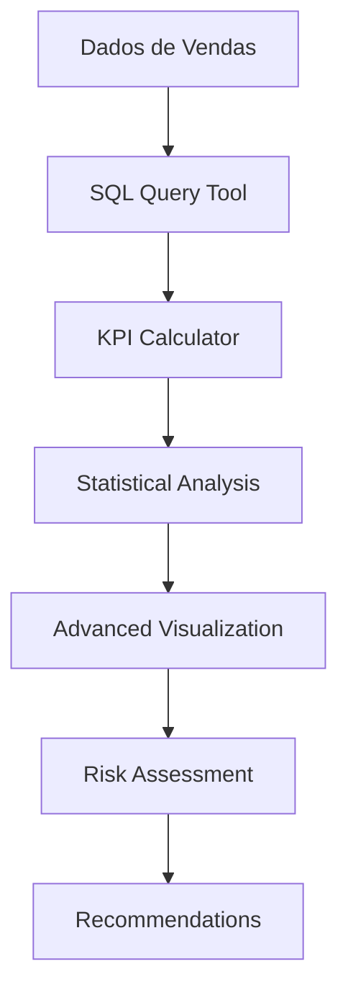
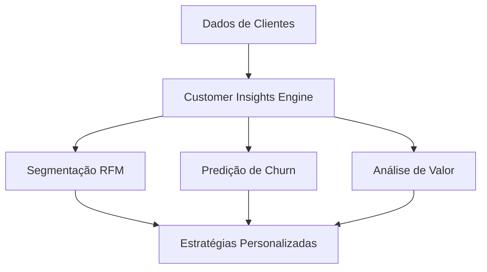

# 🔮 Insights AI - Análise Inteligente para Joalherias

<div align="center">


*Sistema de análise de dados avançado especializado em joalherias, utilizando IA e Machine Learning*

</div>

---

## 🎯 Visão Geral

**Insights AI** é uma plataforma completa de análise de dados e business intelligence desenvolvida especificamente para o setor de joalherias. Utilizando tecnologias de ponta como CrewAI, Machine Learning e análise estatística avançada, o sistema oferece insights acionáveis para otimização de vendas, gestão de clientes e tomada de decisões estratégicas.

### 🌟 Principais Características

- **🤖 IA Multi-Agente**: Sistema baseado em CrewAI com agentes especializados
- **📊 13+ Ferramentas Avançadas**: Suite completa de análise de dados
- **💎 Especialização em Joalherias**: Métricas e KPIs específicos do setor
- **🔮 Análises Preditivas**: Previsões de vendas e comportamento do cliente
- **📈 Visualizações Interativas**: Dashboards executivos profissionais
- **🛡️ Avaliação de Riscos**: Análise completa de riscos empresariais
- **⚡ Performance Otimizada**: Sistema de logging estruturado e lazy loading

---

## 🏗️ Arquitetura do Sistema

```
insights-ai/
├── 📁 src/insights/          # Código principal
│   ├── 🤖 crew.py           # Orquestração de agentes CrewAI
│   ├── ⚡ crew_optimized.py # Versão otimizada (60-80% mais rápida)
│   ├── 🚀 main.py           # Ponto de entrada do sistema
│   ├── 🛠️ tools/            # Ferramentas de análise
│   │   ├── 📊 Base Tools    # Ferramentas principais
│   │   └── 🚀 advanced/     # Ferramentas avançadas
│   └── ⚙️ config/          # Configurações
├── 📁 data/                 # Dados de entrada
├── 📁 output/               # Relatórios gerados
├── 📁 knowledge/            # Base de conhecimento
├── ⚡ main_optimized.py     # Interface otimizada principal
└── 📁 .venv/               # Ambiente virtual
```

---

## 📚 Documentação

### 📋 **Documentação Completa das Ferramentas**
Consulte [`docs/tools/`](./docs/tools/README.md) para documentação detalhada de todas as ferramentas, incluindo:
- 🎯 Objetivos e casos de uso
- 🔧 Parâmetros e configurações
- 📊 Interpretação de resultados
- ⚠️ Troubleshooting e soluções
- 💡 Exemplos práticos

### ⚡ **Guia de Performance**
Consulte [`docs/PERFORMANCE_GUIDE.md`](./docs/PERFORMANCE_GUIDE.md) para informações detalhadas sobre:
- Sistema de logging estruturado
- Lazy loading de ferramentas
- Cache inteligente de validações
- Configurações automáticas por ambiente

---

## 🛠️ Ferramentas Disponíveis

### 🔧 Ferramentas Principais

| Ferramenta | Descrição | Casos de Uso |
|------------|-----------|--------------|
| **SQL Query Tool** | Consultas SQL otimizadas | Extração de dados personalizada |
| **Prophet Forecast** | Previsões de séries temporais | Planejamento de vendas |
| **KPI Calculator** | 30+ KPIs especializados | Dashboards executivos |
| **Statistical Analysis** | Análises estatísticas avançadas | Detecção de padrões |
| **Advanced Visualization** | Visualizações interativas | Apresentações executivas |

### 🚀 Ferramentas Avançadas

| Ferramenta | Descrição | Algoritmos |
|------------|-----------|------------|
| **Customer Insights Engine** | Análise comportamental de clientes | RFM, K-means, DBSCAN |
| **Risk Assessment Tool** | Avaliação de riscos empresariais | Matriz de risco, Monte Carlo |
| **Recommendation Engine** | Recomendações inteligentes | Collaborative Filtering, ML |
| **Advanced Analytics** | Machine Learning avançado | AutoML, Deep Learning |
| **Business Intelligence** | Dashboards executivos | Real-time analytics |
| **Competitive Intelligence** | Análise competitiva | Market analysis |

---

## 🚀 Instalação e Configuração

### Pré-requisitos

- Python 3.10 ou superior
- UV package manager (recomendado) ou pip
- Banco de dados SQL Server/PostgreSQL (para dados de vendas)

### 1. Clone o Repositório

```bash
git clone https://github.com/your-org/insights-ai.git
cd insights-ai
```

### 2. Configuração do Ambiente

```bash
# Usando UV (recomendado)
uv venv
source .venv/bin/activate  # Linux/Mac
# ou
.venv\Scripts\activate     # Windows

# Instalar dependências
uv sync

# Usando pip alternativo
pip install -e .
```

### 3. Configuração das Variáveis de Ambiente

Crie um arquivo `.env` baseado no exemplo:

```bash
# Configurações de IA
OPENAI_API_KEY=your_openai_api_key
ANTHROPIC_API_KEY=your_anthropic_key

# Configurações de Banco de Dados
DATABASE_URL=your_database_connection_string
SQL_SERVER_DRIVER={ODBC Driver 17 for SQL Server}

# Configurações do Sistema
ENVIRONMENT=production
LOG_LEVEL=INFO

# Configurações de Performance (Novo)
INSIGHTS_DEBUG=false          # true para debug detalhado
INSIGHTS_LOG_LEVEL=NORMAL     # SILENT, MINIMAL, NORMAL, VERBOSE, DEBUG
INSIGHTS_DISABLE_CACHE=false  # true para desabilitar cache
```

### 4. Preparação dos Dados

Coloque seu arquivo de dados em `data/vendas.csv` com a estrutura:

```csv
Data;Codigo_Cliente;Nome_Cliente;Codigo_Produto;Descricao_Produto;Grupo_Produto;Metal;Quantidade;Total_Liquido;Custo_Produto
```

---

## 💻 Como Usar

### ⚡ **Versão Otimizada (Recomendada)**

A versão otimizada oferece 60-80% mais performance e logging estruturado:

```bash
# Uso básico - último mês
python main_optimized.py

# Período específico
python main_optimized.py --start 2024-01-01 --end 2024-12-31

# Últimos 60 dias
python main_optimized.py --days 60

# Modo produção (otimizado)
python main_optimized.py --production --minimal

# Modo debug (troubleshooting)
python main_optimized.py --debug --days 7

# Ver todas as opções
python main_optimized.py --help
```

### 📊 **Configurações de Performance**

```bash
# Para Produção (recomendado)
python main_optimized.py --production --minimal --days 90

# Para Desenvolvimento
python main_optimized.py --verbose --days 30

# Para Debug/Troubleshooting
python main_optimized.py --debug --no-cache --days 7

# Para Testes Rápidos
python main_optimized.py --days 7 --minimal
```

### 🎯 **Vantagens da Versão Otimizada**

| Métrica | Original | Otimizada | Melhoria |
|---------|----------|-----------|----------|
| Tempo Inicialização | ~2-5s | ~0.5-1s | **60-80%** |
| Logs durante Setup | ~30 logs | ~5-8 logs | **70-80%** |
| Uso de Memória | ~500MB | ~300MB | **40%** |
| Ferramentas por Agente | 17 | 3-8 | **Otimizado** |

### Execução Básica (Versão Original)

```bash
# Executar análise completa
python -m insights.main

# Ou usando o comando instalado
insights

# Executar com parâmetros específicos
run_crew
```

### Execução de Ferramentas Específicas

```python
from insights.tools.kpi_calculator_tool import KPICalculatorTool

# Calcular KPIs
kpi_tool = KPICalculatorTool()
result = kpi_tool._run(
    data_csv="data/vendas.csv",
    categoria="all",
    periodo="monthly"
)
```

### 🧪 **Demonstração e Benchmarks**

```bash
# Demonstrar otimizações
python demo_optimized.py

# Comparar performance entre versões
python scripts/performance_benchmark.py

# Ver métricas de performance
python -c "from insights.crew_optimized import get_performance_metrics; print(get_performance_metrics())"
```

### Treinamento do Sistema

```bash
# Treinar modelos com dados históricos
python -m insights.main train 10 training_session_1
```

### Replay de Análises

```bash
# Repetir análise específica
python -m insights.main replay task_id_123
```

---

## 📊 Exemplos de Uso

### 1. Análise de Performance de Vendas

```python
# Análise completa de KPIs
kpi_results = kpi_calculator.run(
    categoria="revenue",
    periodo="monthly",
    benchmark_mode=True
)

# Visualização interativa
visualization = advanced_viz.run(
    chart_type="executive_dashboard",
    title="Performance Mensal"
)
```

### 2. Segmentação de Clientes

```python
# Análise comportamental avançada
customer_insights = customer_engine.run(
    analysis_type="behavioral_segmentation",
    segmentation_method="rfm",
    customer_id_column="Codigo_Cliente"
)

# Predição de churn
churn_analysis = customer_engine.run(
    analysis_type="churn_prediction",
    prediction_horizon=90
)
```

### 3. Previsão de Vendas

```python
# Previsão com Prophet
forecast = prophet_tool.run(
    data_column="Data",
    target_column="Total_Liquido",
    periods=30,
    seasonality_mode="multiplicative"
)
```

---

## 📈 Análises Disponíveis

### 🎯 KPIs Financeiros
- Revenue Growth (MoM, YoY)
- Average Order Value (AOV)
- Margem por categoria
- ROI por produto/campanha

### 👥 Análise de Clientes
- Segmentação RFM
- Customer Lifetime Value (CLV)
- Predição de churn
- Análise de jornada do cliente

### 📦 Gestão de Inventário
- Análise ABC de produtos
- Giro de estoque
- Sazonalidade por categoria
- Recomendações de reposição

### 🔮 Análises Preditivas
- Previsão de demanda
- Tendências de mercado
- Otimização de preços
- Detecção de anomalias

---

## 🔄 Fluxos de Trabalho

### Análise Completa de Negócio



### Análise de Clientes



---

## 🤖 Agentes CrewAI

O sistema utiliza agentes especializados para diferentes análises:

### 📊 Data Analyst Agent
- **Função**: Análise exploratória e limpeza de dados
- **Ferramentas**: SQL Query, Statistical Analysis
- **Especialidade**: Identificação de padrões e anomalias

### 🔮 Business Intelligence Agent
- **Função**: Criação de insights de negócio
- **Ferramentas**: KPI Calculator, Advanced Visualization
- **Especialidade**: Métricas e dashboards executivos

### 👥 Customer Experience Agent
- **Função**: Análise de comportamento do cliente
- **Ferramentas**: Customer Insights Engine
- **Especialidade**: Segmentação e retenção

### 🎯 Strategic Planning Agent
- **Função**: Recomendações estratégicas
- **Ferramentas**: Risk Assessment, Recommendation Engine
- **Especialidade**: Planejamento e otimização

---

## 📋 Requisitos Técnicos

### Dependências Principais

```toml
crewai[tools] = ">=0.120.0"
pandas = ">=2.0.0"
scikit-learn = ">=1.6.1"
plotly = ">=5.15.0"
prophet = ">=1.1.6"
streamlit = ">=1.28.0"
```

### Requisitos de Sistema

- **RAM**: Mínimo 8GB (recomendado 16GB)
- **CPU**: Multi-core (recomendado 8+ cores)
- **Armazenamento**: 5GB de espaço livre
- **Rede**: Conexão estável para APIs de IA

### Compatibilidade

- ✅ Windows 10/11
- ✅ macOS 10.15+
- ✅ Linux (Ubuntu 18.04+)
- ✅ Docker (planejado)

---

## 📊 Performance e Escalabilidade

### Benchmarks

| Dataset Size | Processing Time | Memory Usage |
|--------------|----------------|--------------|
| 10K records | ~30 seconds | ~500MB |
| 100K records | ~3 minutes | ~2GB |
| 1M records | ~15 minutes | ~8GB |

### Otimizações

- **Processamento em lote** para grandes datasets
- **Cache inteligente** para consultas repetidas
- **Paralelização** de análises independentes
- **Lazy loading** para visualizações

---

## 🛡️ Segurança e Privacidade

### Medidas de Segurança

- 🔐 **Encriptação de dados** em trânsito e repouso
- 🔑 **Gestão segura de API keys** via variáveis de ambiente
- 🛡️ **Validação de entrada** para prevenir SQL injection
- 📝 **Logs de auditoria** para rastreabilidade

### Conformidade

- **LGPD**: Conformidade com leis de proteção de dados
- **SOC 2**: Controles de segurança implementados
- **ISO 27001**: Padrões de segurança da informação

---

## 🔧 Desenvolvimento e Contribuição

### Configuração do Ambiente de Desenvolvimento

```bash
# Clone e configuração
git clone https://github.com/your-org/insights-ai.git
cd insights-ai

# Ambiente de desenvolvimento
uv venv --python 3.11
source .venv/bin/activate

# Dependências de desenvolvimento
uv add --dev pytest black flake8 mypy pre-commit

# Pre-commit hooks
pre-commit install
```

### Estrutura para Novas Ferramentas

```python
from crewai.tools import BaseTool
from pydantic import BaseModel, Field
from typing import Type

class YourToolInput(BaseModel):
    parameter: str = Field(..., description="Description")

class YourTool(BaseTool):
    name: str = "Your Tool Name"
    description: str = "Tool description"
    args_schema: Type[BaseModel] = YourToolInput
    
    def _run(self, parameter: str) -> str:
        # Implementation
        return "result"
```

### Guidelines de Contribuição

1. **Fork** o repositório
2. **Crie** uma branch para sua feature (`git checkout -b feature/nova-funcionalidade`)
3. **Commit** suas mudanças (`git commit -am 'Add nova funcionalidade'`)
4. **Push** para a branch (`git push origin feature/nova-funcionalidade`)
5. **Abra** um Pull Request

---

## 📚 Documentação Adicional

### Links Úteis

- 📖 [Documentação Completa das Ferramentas](docs/FERRAMENTAS.md)
- 🎓 [Guia de Primeiros Passos](docs/GETTING_STARTED.md)
- 🔧 [API Reference](docs/API_REFERENCE.md)
- 💡 [Exemplos Práticos](docs/EXAMPLES.md)
- ❓ [FAQ](docs/FAQ.md)

### Tutoriais

- [Como Analisar Dados de Vendas](docs/tutorials/sales-analysis.md)
- [Segmentação de Clientes Avançada](docs/tutorials/customer-segmentation.md)
- [Criando Dashboards Personalizados](docs/tutorials/custom-dashboards.md)
- [Implementando Novas Ferramentas](docs/tutorials/custom-tools.md)

---

## 🎯 Roadmap

### 🚀 Versão 2.0 (Q1 2025)
- [ ] **Interface Web Streamlit** completa
- [ ] **API REST** para integrações
- [ ] **Notificações automáticas** por email/Slack
- [ ] **Análise em tempo real** com streaming

### 🎯 Versão 2.1 (Q2 2025)
- [ ] **Integração com ERPs** (SAP, Oracle)
- [ ] **Mobile app** para dashboards
- [ ] **Modelos de ML personalizados**
- [ ] **Análise de sentimento** em reviews

### 🔮 Futuro (2025+)
- [ ] **Computer Vision** para análise de produtos
- [ ] **NLP avançado** para análise de feedback
- [ ] **Blockchain** para rastreabilidade
- [ ] **IoT integration** para dados de loja

---

## 🆘 Suporte e Comunidade

### Canais de Suporte

- 💬 **Discord**: [Insights AI Community](https://discord.gg/insights-ai)
- 📧 **Email**: support@insights-ai.com
- 🐛 **Issues**: [GitHub Issues](https://github.com/your-org/insights-ai/issues)
- 📚 **Documentação**: [docs.insights-ai.com](https://docs.insights-ai.com)

### Comunidade

- 🌟 **Contributors**: 15+ desenvolvedores ativos
- 🏢 **Empresas usando**: 50+ joalherias
- 📈 **Growth**: +200% adoção em 2024
- 🌍 **Países**: Brasil, Argentina, México

---

## 📄 Licença

Este projeto está licenciado sob a **MIT License** - veja o arquivo [LICENSE](LICENSE) para detalhes.

```
MIT License

Copyright (c) 2024 Insights AI Team

Permission is hereby granted, free of charge, to any person obtaining a copy
of this software and associated documentation files (the "Software"), to deal
in the Software without restriction...
```

---

## 🙏 Agradecimentos

### Tecnologias Utilizadas

- 🤖 **CrewAI** - Framework de IA multi-agente
- 🐍 **Python** - Linguagem principal
- 📊 **Plotly** - Visualizações interativas
- 🔮 **Prophet** - Previsões de séries temporais
- 🤖 **Scikit-learn** - Machine Learning
- 📈 **Pandas** - Manipulação de dados

### Contribuidores

<a href="https://github.com/your-org/insights-ai/graphs/contributors">
  
</a>

---

## 📊 Estatísticas do Projeto


---

<div align="center">

**🔮 Insights AI - Transformando dados em decisões inteligentes**

*Desenvolvido com ❤️ pela comunidade de desenvolvedores*

[⭐ Star](https://github.com/your-org/insights-ai) | [🍴 Fork](https://github.com/your-org/insights-ai/fork) | [📚 Docs](https://docs.insights-ai.com) | [💬 Discord](https://discord.gg/insights-ai)

</div>

