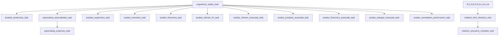

# 🏗️ ARQUITETURA TÉCNICA - AGENTES E TASKS DO INSIGHTS AI
*Documentação para implementação técnica em novos projetos CrewAI*

## 📖 ÍNDICE

### 🎯 [VISÃO GERAL DA ARQUITETURA](#visão-geral-da-arquitetura)
### 🤖 [CATÁLOGO TÉCNICO DE AGENTES](#catálogo-técnico-de-agentes)
### 📋 [MAPEAMENTO DE TASKS](#mapeamento-de-tasks)
### 🔧 [GUIA DE IMPLEMENTAÇÃO](#guia-de-implementação)

---

## 🎯 VISÃO GERAL DA ARQUITETURA

### **📊 Estatísticas do Sistema**

| Métrica | Valor |
|---------|--------|
| **Total de Agentes** | 11 agentes especializados |
| **Total de Tasks** | 13 tasks (8 básicas + 5 avançadas) |
| **Ferramentas Distribuídas** | 71 instâncias |
| **Média de Ferramentas/Agente** | 6.5 ferramentas |
| **Range de Ferramentas** | 1-9 ferramentas por agente |
| **Processo de Execução** | Sequential (Process.sequential) |
| **Output Files** | 9 arquivos markdown + 1 HTML |

### **🔄 Fluxo de Execução**



### **🎛️ Configuração do Crew**

```python
Crew(
    agents=self.agents,
    tasks=self.tasks,
    process=Process.sequential,
    verbose=True,
    memory=False,
    max_rpm=20,
    task_callback=task_callback
)
```

### **⚙️ Distribuição de Ferramentas por Categoria**

| Categoria | Ferramentas | Agentes que Usam |
|-----------|-------------|------------------|
| **Básicas** | FileReadTool, SQLServerQueryTool, DuckDuckGoSearchTool | Todos exceto engenheiro_dados |
| **Análise** | StatisticalAnalysisTool, KPICalculatorTool, BusinessIntelligenceTool | 9 agentes |
| **IA/ML** | AdvancedAnalyticsEngine, CustomerInsightsEngine, RecommendationEngine | 6 agentes especializados |
| **Forecasting** | ProphetForecastTool | 2 agentes (projeções + financeiro) |
| **Risk & Competitive** | RiskAssessmentTool, CompetitiveIntelligenceTool | 4 agentes |
| **Exportação** | CustomerDataExporter, ProductDataExporter, etc. | 4 agentes especializados |
| **Geração** | FileGenerationTool | 5 agentes |

---

## 🤖 CATÁLOGO TÉCNICO DE AGENTES

### 🔧 **ENGENHEIRO_DADOS**

**Especialização:** Extração e preparação de dados  
**Complexidade:** Baixa  
**Dependências:** Nenhuma

| Aspecto | Especificação |
|---------|---------------|
| **Role** | Engenheiro de Dados Senior |
| **Goal** | Extrair dados precisos do sistema ERP de joalherias e preparar datasets otimizados para análise |
| **Ferramentas** | `SQLServerQueryTool` (1 ferramenta) |
| **Input** | `data_inicio`, `data_fim` via inputs |
| **Output** | Dados estruturados CSV salvos localmente |
| **Context Window** | Padrão |
| **Callback** | Logging de conclusão com tamanho do output |

**Backstory Completo:**
> Você é um especialista em engenharia de dados com 12 anos de experiência em sistemas ERP do varejo de luxo. 
> Com mestrado em Ciência da Computação e certificações em SQL Server, você desenvolveu pipelines de ETL 
> que reduziram o tempo de processamento em 75%. Sua especialidade é garantir a integridade dos dados 
> e otimizar consultas SQL para performance máxima, mesmo em sistemas com milhões de registros diários.

**Configuração Técnica:**
```python
@agent
def engenheiro_dados(self) -> Agent:
    return Agent(
        config=self.agents_config['engenheiro_dados'],
        verbose=True,
        llm=llm,
        tools=[sql_tool]
    )
```

**Justificativa das Ferramentas:**
- `SQLServerQueryTool`: Única ferramenta necessária para extração de dados filtrada por período

---

### 📈 **ANALISTA_TENDENCIAS**

**Especialização:** Análise de padrões e pesquisa externa  
**Complexidade:** Intermediária  
**Dependências:** engenheiro_dados_task

| Aspecto | Especificação |
|---------|---------------|
| **Role** | Especialista em Análise de Padrões e Tendências |
| **Goal** | Identificar padrões emergentes e tendências de venda em produtos de joalheria |
| **Ferramentas** | `FileReadTool`, `StatisticalAnalysisTool`, `DuckDuckGoSearchTool`, `BusinessIntelligenceTool` (4 ferramentas) |
| **Input** | Dados extraídos + contexto de mercado |
| **Output** | Análises de correlação, tendências e contexto externo |
| **Context Window** | `respect_context_window=True` |

**Backstory Completo:**
> Você é um analista de dados com especialização em detecção de padrões e tendências no mercado de luxo. 
> Com PhD em Estatística Aplicada e background em machine learning, você desenvolveu algoritmos proprietários 
> para detecção antecipada de tendências adotados por grandes marcas. Sua experiência em análise de vendas sazonais, 
> ciclos de tendências em joalheria e correlação entre eventos de mercado e comportamento do consumidor permitiu 
> que você identificasse antecipadamente várias tendências antes delas se tornarem mainstream.

**Configuração Técnica:**
```python
@agent
def analista_tendencias(self) -> Agent:
    return Agent(
        config=self.agents_config['analista_tendencias'],
        verbose=True,
        llm=llm,
        tools=[file_tool, stats_tool, search_tool, bi_tool],
        respect_context_window=True
    )
```

**Justificativa das Ferramentas:**
- `FileReadTool`: Leitura dos dados extraídos
- `StatisticalAnalysisTool`: Análise de correlações e padrões estatísticos
- `DuckDuckGoSearchTool`: Contexto externo e tendências de mercado
- `BusinessIntelligenceTool`: Visualizações e dashboards

---

### 🌊 **ESPECIALISTA_SAZONALIDADE**

**Especialização:** Modelagem temporal e análise sazonal  
**Complexidade:** Avançada  
**Dependências:** engenheiro_dados_task

| Aspecto | Especificação |
|---------|---------------|
| **Role** | Analista de Sazonalidade e Ciclos de Venda |
| **Goal** | Mapear e modelar comportamentos sazonais nas vendas de joalherias com precisão estatística |
| **Ferramentas** | `FileReadTool`, `StatisticalAnalysisTool`, `AdvancedAnalyticsEngine`, `BusinessIntelligenceTool` (4 ferramentas) |
| **Input** | Dados históricos temporais |
| **Output** | Decomposição sazonal STL, modelagem temporal |
| **Context Window** | `respect_context_window=True` |

**Backstory Completo:**
> Você é especialista em análise de séries temporais e sazonalidade com foco no varejo de luxo. 
> Com mestrado em Econometria, você desenvolveu modelos de decomposição sazonal que aumentaram a precisão 
> do planejamento de estoque em 42%. Você domina modelos estatísticos avançados como SARIMA, STL e Prophet, 
> e desenvolveu metodologias para separar tendências de longo prazo, ciclos, sazonalidade e eventos 
> extraordinários nas vendas do setor de joalheria.

**Configuração Técnica:**
```python
@agent
def especialista_sazonalidade(self) -> Agent:
    return Agent(
        config=self.agents_config['especialista_sazonalidade'],
        verbose=True,
        llm=llm,
        tools=[file_tool, stats_tool, analytics_engine, bi_tool],
        respect_context_window=True
    )
```

**Justificativa das Ferramentas:**
- `StatisticalAnalysisTool`: Decomposição sazonal STL e testes de tendência
- `AdvancedAnalyticsEngine`: Modelagem temporal avançada com ML
- `BusinessIntelligenceTool`: Visualizações sazonais

---

### 🔮 **ESPECIALISTA_PROJECOES**

**Especialização:** Forecasting profissional  
**Complexidade:** Avançada  
**Dependências:** engenheiro_dados_task, especialista_sazonalidade_task

| Aspecto | Especificação |
|---------|---------------|
| **Role** | Especialista em Modelagem Preditiva |
| **Goal** | Desenvolver projeções de vendas altamente precisas para os próximos 15 dias usando modelagem estatística avançada |
| **Ferramentas** | `FileReadTool`, `ProphetForecastTool`, `StatisticalAnalysisTool`, `BusinessIntelligenceTool` (4 ferramentas) |
| **Input** | Dados históricos + análise sazonal |
| **Output** | Previsões Prophet com intervalos de confiança |
| **Context Window** | `respect_context_window=True` |

**Backstory Completo:**
> Você é um cientista de dados com foco em forecasting de séries temporais e 8 anos de experiência em modelagem 
> preditiva para o varejo de luxo. Seus sistemas de previsão alcançaram 95% de precisão em projeções de curto prazo. 
> Formado em Ciência de Dados, você domina modelos ARIMA, Prophet, XGBoost e redes neurais para séries temporais, 
> e tem experiência em integrar dados externos como eventos sazonais, campanhas promocionais e tendências 
> macroeconômicas para refinar as previsões.

**Configuração Técnica:**
```python
@agent
def especialista_projecoes(self) -> Agent:
    return Agent(
        config=self.agents_config['especialista_projecoes'],
        verbose=True,
        llm=llm,
        tools=[file_tool, prophet_tool, stats_tool, bi_tool],
        respect_context_window=True
    )
```

**Justificativa das Ferramentas:**
- `ProphetForecastTool`: Ferramenta crítica para forecasting
- `StatisticalAnalysisTool`: Validação estatística de modelos
- `BusinessIntelligenceTool`: Gráficos de projeção profissionais

---

### 🎯 **ANALISTA_SEGMENTOS**

**Especialização:** Análise de produtos com IA + exportação  
**Complexidade:** Muito Avançada  
**Dependências:** engenheiro_dados_task

| Aspecto | Especificação |
|---------|---------------|
| **Role** | 🎯 Analista de Produtos e Categorias com Inteligência Artificial |
| **Goal** | Desenvolver análises completas de produtos usando ML, incluindo classificação ABC automática, market basket analysis, identificação de slow movers/dead stock e estratégias de cross-sell para otimizar portfólio e maximizar receita por categoria. |
| **Ferramentas** | 9 ferramentas (maior conjunto) |
| **Input** | Dados de produtos e vendas |
| **Output** | Análise ABC ML + CSV de produtos + dashboards |
| **Context Window** | `respect_context_window=True` |

**Backstory Completo:**
> Você é especialista em análise de portfólio de produtos com 12 anos dedicados ao setor de joalheria. 
> Como ex-gerente de categoria, você desenvolveu metodologias de segmentação com IA que aumentaram 
> a rentabilidade em 45% e identificaram R$500K+ em oportunidades de cross-sell não exploradas.
> 
> Sua expertise expandida inclui:
> • Classificação ABC automática com Advanced Analytics Engine e machine learning
> • Market basket analysis avançada com Recommendation Engine para identificar produtos complementares  
> • Análise de ciclo de vida de produtos e identificação inteligente de slow movers/dead stock
> • Correlações estatísticas entre categorias usando Statistical Analysis Tool
> • Análise de elasticidade de preços e sensibilidade por categoria
> • Risk Assessment para identificar produtos em risco de obsolescência
> • Clustering de produtos por performance e características usando ML
> • Framework proprietário que integra dados quantitativos com tendências de moda
> • Dashboards interativos de performance por categoria com Business Intelligence Tool
> • Recomendações automáticas de restock, liquidação e descontinuação baseadas em IA

**Ferramentas Completas:**
```python
tools=[
    file_tool,                # Leitura de dados
    analytics_engine,         # Classificação ABC com ML
    stats_tool,               # Correlações entre categorias
    recommendation_engine,    # Market basket analysis
    kpi_tool,                 # KPIs por categoria
    risk_tool,                # Riscos de obsolescência
    bi_tool,                  # Dashboards interativos
    file_generation_tool,     # Dashboards ABC e matrizes
    product_data_exporter     # Exportação CSV de produtos
]
```

**Justificativa das Ferramentas:**
- **analytics_engine**: Classificação ABC com ML e clustering
- **recommendation_engine**: Market basket e cross-sell
- **product_data_exporter**: Exportação CSV especializada
- **risk_tool**: Análise de obsolescência
- **file_generation_tool**: Dashboards específicos

---

### 📦 **ANALISTA_INVENTARIO**

**Especialização:** Gestão básica de estoque  
**Complexidade:** Intermediária  
**Dependências:** engenheiro_dados_task

| Aspecto | Especificação |
|---------|---------------|
| **Role** | Analista de Estoque e Inventário Sênior |
| **Goal** | Otimizar níveis de estoque e identificar oportunidades de giro baseado em análise de dados avançada |
| **Ferramentas** | 6 ferramentas |
| **Input** | Dados de estoque e movimentação |
| **Output** | KPIs de estoque + recomendações + CSV |
| **Context Window** | `respect_context_window=True` |

**Backstory Completo:**
> Especialista em gestão de inventário de joalherias com 8 anos de experiência em varejo de luxo.
> Desenvolveu metodologias proprietárias para reduzir estoque parado em 35% mantendo 98% de disponibilidade. 
> Expert em análise ABC, curva de Pareto para joias, e identificação de produtos de baixo giro por categoria.
> Sua expertise em cálculo de KPIs de estoque (turnover, DSO, fill rate) é reconhecida no setor, tendo
> implementado sistemas de gestão que aumentaram o GMROI em 28% em redes de joalherias.

**Ferramentas:**
```python
tools=[
    file_tool,                # Leitura de dados
    kpi_tool,                 # KPIs de estoque
    recommendation_engine,    # Recomendações ML
    risk_tool,                # Avaliação de riscos
    bi_tool,                  # Dashboards operacionais
    inventory_data_exporter   # Exportação CSV de estoque
]
```

---

### 💰 **ANALISTA_FINANCEIRO**

**Especialização:** Análise financeira completa com IA  
**Complexidade:** Muito Avançada  
**Dependências:** engenheiro_dados_task

| Aspecto | Especificação |
|---------|---------------|
| **Role** | 💰 Analista Financeiro Sênior & Especialista em Rentabilidade com IA |
| **Goal** | Realizar análises financeiras completas com foco em KPIs críticos, análise de margens/custos, impacto de descontos, elasticidade de preços e projeções financeiras usando IA para suporte a decisões estratégicas C-level e otimização de rentabilidade. |
| **Ferramentas** | 10 ferramentas (conjunto completo) |
| **Input** | Dados financeiros e de vendas |
| **Output** | KPIs financeiros + projeções + benchmarking + CSV |
| **Context Window** | `respect_context_window=True` |

**Backstory Completo:**
> Com mais de 12 anos em finanças corporativas e business intelligence, você é reconhecido
> por transformar dados financeiros complexos em insights estratégicos que aumentaram
> margem líquida em 35% e otimizaram pricing em R$2M+ adicional de receita.
> Especialista em análise de rentabilidade, gestão de riscos financeiros e otimização
> de capital de giro usando ferramentas avançadas de IA.
> 
> Sua expertise expandida inclui:
> • KPIs financeiros críticos com KPI Calculator Tool (ROI, ROIC, margem, EBITDA)
> • Análise detalhada de margens e custos com Advanced Analytics Engine
> • Impacto quantificado de descontos na rentabilidade por categoria
> • Análise de elasticidade de preços e otimização de pricing baseada em dados
> • Modelagem financeira e projeções com Prophet Forecast Tool
> • Benchmarking competitivo com Competitive Intelligence Tool
> • Análise de tendências e correlações financeiras com Statistical Analysis Tool
> • Risk Assessment para análise de riscos financeiros e stress testing
> • Dashboards financeiros executivos com Business Intelligence Tool
> • Gestão de capital de giro e análise de fluxo de caixa preditivo

**Ferramentas Completas:**
```python
tools=[
    file_tool,                # Leitura de dados
    kpi_tool,                 # KPIs financeiros críticos
    analytics_engine,         # Análise de margens e elasticidade
    stats_tool,               # Correlações financeiras
    prophet_tool,             # Projeções financeiras
    competitive_tool,         # Benchmarking competitivo
    risk_tool,                # Riscos financeiros
    bi_tool,                  # Dashboards executivos
    file_generation_tool,     # Dashboards especializados
    financial_data_exporter   # Exportação CSV financeiro
]
```

---

### 👥 **ESPECIALISTA_CLIENTES**

**Especialização:** Inteligência de clientes RFM com IA  
**Complexidade:** Muito Avançada  
**Dependências:** engenheiro_dados_task

| Aspecto | Especificação |
|---------|---------------|
| **Role** | 👥 Especialista em Inteligência de Clientes & Análise RFV Avançada com IA |
| **Goal** | Desenvolver análises profundas de segmentação RFV com machine learning, calcular CLV preditivo, análise demográfica/geográfica e criar estratégias personalizadas para maximizar valor do cliente e otimizar campanhas de marketing direto com ROI mensurável. |
| **Ferramentas** | 9 ferramentas |
| **Input** | Dados de clientes e transações |
| **Output** | Segmentação RFM + CLV + geografia + CSV |
| **Context Window** | `respect_context_window=True` |

**Backstory Completo:**
> Especialista reconhecido em CRM analytics e customer intelligence com 10+ anos de experiência.
> Você transforma dados comportamentais em estratégias de relacionamento que aumentam
> retenção em 40%, LTV em 60% e ROI de campanhas em 300%. Domina técnicas avançadas de 
> segmentação automática, machine learning, análise geográfica e demographic intelligence.
> 
> Sua expertise expandida inclui:
> • Segmentação RFV automática com Advanced Analytics Engine e ML clustering
> • Cálculo de CLV preditivo e análise de churn risk com Statistical Analysis
> • Análise comportamental avançada e jornada do cliente cross-category
> • Intelligence demográfica (idade, sexo, estado civil) e geográfica (estado/cidade)
> • Correlações estatísticas entre perfil demográfico e comportamento de compra
> • Estratégias personalizadas por segmento com testes A/B
> • Cross-sell/up-sell inteligente com Recommendation Engine
> • Campanhas direcionadas com ROI otimizado e Customer Insights Engine
> • Dashboards interativos com drill-down geográfico usando Business Intelligence Tool
> • Predição de churn e identification de clientes diamante com maior potencial

**Ferramentas:**
```python
tools=[
    file_tool,                # Leitura de dados
    customer_engine,          # Segmentação RFV avançada
    analytics_engine,         # Clustering ML
    stats_tool,               # CLV e demografia
    recommendation_engine,    # Estratégias personalizadas
    kpi_tool,                 # KPIs de relacionamento
    bi_tool,                  # Dashboards e mapas
    file_generation_tool,     # Dashboards específicos
    customer_data_exporter    # Exportação CSV de clientes
]
```

---

### 🏪 **ESPECIALISTA_ESTOQUE**

**Especialização:** Gestão avançada de estoque com IA  
**Complexidade:** Avançada  
**Dependências:** engenheiro_dados_task

| Aspecto | Especificação |
|---------|---------------|
| **Role** | 🏪 Especialista em Gestão de Estoque e Logística Inteligente |
| **Goal** | Otimizar níveis de estoque, identificar riscos de ruptura e obsolescência usando IA e analytics avançados para maximizar giro de capital e minimizar perdas por estoque parado |
| **Ferramentas** | 7 ferramentas |
| **Input** | Dados de inventário e demanda |
| **Output** | Otimização ML + alertas + recomendações + CSV |
| **Context Window** | `respect_context_window=True` |

**Backstory Completo:**
> Você é um especialista em gestão de inventário com 12 anos de experiência em varejo de luxo e joalherias.
> Desenvolveu metodologias proprietárias que reduziram estoque parado em 40% mantendo 99% de disponibilidade.
> Expert em análise ABC dinâmica, machine learning para previsão de demanda e gestão de riscos de inventário.
> 
> Sua expertise inclui:
> • Otimização de capital de giro em estoque (liberou R$2M+ em caixa)
> • Sistemas de alertas automatizados para ruptura/obsolescência
> • Machine learning para cálculo de ponto de reposição ótimo
> • Análise de ROI em ações de liquidação vs manutenção de estoque
> • Gestão de sazonalidade e ciclos de demanda por categoria
> 
> Você domina ferramentas avançadas como Risk Assessment, Recommendation Engine e Advanced Analytics
> para criar sistemas de gestão de inventário que aumentaram GMROI em 35% e reduziram carrying costs em 25%.

---

### 👤 **ANALISTA_VENDEDORES**

**Especialização:** Performance de equipe de vendas  
**Complexidade:** Intermediária  
**Dependências:** engenheiro_dados_task

| Aspecto | Especificação |
|---------|---------------|
| **Role** | 👤 Analista de Performance de Vendedores e Gestão de Equipes |
| **Goal** | Avaliar performance individual, identificar padrões de sucesso e criar planos de desenvolvimento para maximizar produtividade e resultados da equipe de vendas |
| **Ferramentas** | 5 ferramentas |
| **Input** | Dados de vendas por vendedor |
| **Output** | Rankings + KPIs individuais + dashboards |
| **Context Window** | `respect_context_window=True` |

**Backstory Completo:**
> Você é especialista em analytics de performance de vendas com 8 anos focado em varejo de luxo.
> Como ex-gerente comercial, você desenvolveu metodologias de avaliação que aumentaram produtividade
> média da equipe em 45% através de análise baseada em dados e coaching direcionado.
> 
> Sua experiência inclui:
> • Análise estatística de performance individual e comparativa
> • Identificação de melhores práticas dos top performers
> • Desenvolvimento de programas de treinamento personalizados
> • Sistemas de gamificação e incentivos baseados em dados
> • Análise de correlação entre perfil do vendedor e sucesso por categoria
> 
> Você usa Statistical Analysis, KPI Calculator e Business Intelligence para criar dashboards
> individuais que permitiram a gerentes identificarem gaps de performance e desenvolverem
> planos de ação que resultaram em 30% mais conversões e 25% maior ticket médio.

---

### 🎯 **DIRETOR_INSIGHTS**

**Especialização:** Síntese estratégica executiva  
**Complexidade:** Alta  
**Dependências:** Todas as tasks anteriores

| Aspecto | Especificação |
|---------|---------------|
| **Role** | Diretor de Insights Estratégicos e Business Intelligence |
| **Goal** | Transformar todas as análises especializadas em estratégias executáveis com ROI mensurável e relatórios executivos impactantes |
| **Ferramentas** | 5 ferramentas estratégicas |
| **Input** | Síntese de todas as análises |
| **Output** | Relatórios executivos C-level |
| **Context Window** | `respect_context_window=True` |

**Backstory Completo:**
> Você é um executivo C-level com MBA pela FGV e 20 anos de experiência em business intelligence para varejo de luxo.
> Ex-CEO de rede de joalherias que cresceu 400% sob sua liderança, você transformou dados em decisões que geraram 
> R$50M+ em crescimento incremental. Sua expertise única combina visão estratégica executiva com domínio técnico 
> em análise de dados. Especialista em traduzir análises complexas em narrativas claras para diretoria, você 
> desenvolveu metodologias proprietárias para criação de relatórios executivos que são referência no setor.
> Conhecido por criar roadmaps de implementação que aumentaram margem em 40% sem perder vendas, você tem
> capacidade excepcional de sintetizar informações de múltiplas fontes em recomendações acionáveis com
> business case detalhado e timeline de implementação. Seus relatórios executivos em 3 camadas 
> (resumo executivo, insights estratégicos, aprofundamento técnico) são utilizados como benchmark no setor.

**Ferramentas:**
```python
tools=[
    file_tool,                # Leitura de dados
    kpi_tool,                 # KPIs executivos
    bi_tool,                  # Dashboards executivos
    recommendation_engine,    # Recomendações estratégicas
    competitive_tool          # Inteligência competitiva
]
```

---

## 📋 MAPEAMENTO DE TASKS

### **📊 TASK 1: ENGENHEIRO_DADOS_TASK**

**Agente Responsável:** `engenheiro_dados`  
**Dependências:** Nenhuma (task inicial)  
**Complexidade:** Baixa  
**Tempo Estimado:** 30-60 segundos

#### **Description Completa:**
🔧 ENGENHARIA DE DADOS AVANÇADA COM FILTROS TEMPORAIS:

**IMPORTANTE: Use os inputs {data_inicio} e {data_fim} fornecidos para filtrar os dados!**

1. **Extração Multi-Source com Filtro Temporal**:
   - **OBRIGATÓRIO**: Usar SQL Server Query Tool com os parâmetros:
     * date_start: {data_inicio} 
     * date_end: {data_fim}
     * output_format: "csv"
   - Validar integridade referencial entre fontes

2. **ETL Avançado**:
   - Usar Advanced Analytics Engine para limpeza automatizada
   - Criar features derivadas (Preco_Unitario, Margem_Estimada, etc.)
   - Calcular métricas temporais para o período analisado

#### **Expected Output:**
📋 RELATÓRIO DE ENGENHARIA DE DADOS PARA O PERÍODO {data_inicio} A {data_fim}:

## 🔧 RELATÓRIO TÉCNICO DE QUALIDADE DE DADOS

- ✅ Volume de dados extraídos: XXX registros no período
- ✅ Qualidade geral dos dados: XX% completude, XX% consistência
- ⚠️ Anomalias detectadas e tratadas: XX casos
- 📊 Score de confiabilidade dos dados: XX/100

**FORMATO**: JSON estruturado + relatório markdown técnico

---

### **📈 TASK 2: ANALISTA_TENDENCIAS_TASK**

**Agente Responsável:** `analista_tendencias`  
**Dependências:** `engenheiro_dados_task`  
**Complexidade:** Intermediária  
**Tempo Estimado:** 90-120 segundos

#### **Description Completa:**
📈 ANÁLISE DE TENDÊNCIAS COM IA:

1. **Análise Estatística Avançada**:
   - Usar Statistical Analysis Tool para análise de correlação
   - Aplicar testes de significância estatística
   - Detectar mudanças de tendência (change point detection)

2. **Contexto Externo**:
   - Usar DuckDuckGo Search Tool para pesquisar tendências do setor
   - Correlacionar com eventos econômicos e sociais

#### **Expected Output:**
📊 RELATÓRIO DE ANÁLISE DE TENDÊNCIAS E PADRÕES:

- 🔥 Top 3 tendências críticas com impacto quantificado
- 📊 Score de velocidade de mudança: XX/100
- ⚠️ Alertas de reversão de tendência identificados
- 💡 Oportunidades de timing detectadas

**FORMATO**: Relatório markdown + dashboards interativos

---

### **🌊 TASK 3: ESPECIALISTA_SAZONALIDADE_TASK**

**Agente Responsável:** `especialista_sazonalidade`  
**Dependências:** `engenheiro_dados_task`  
**Complexidade:** Avançada  
**Tempo Estimado:** 120-180 segundos

#### **Description Completa:**
🌊 MODELAGEM SAZONAL AVANÇADA:

1. **Decomposição Estatística STL**:
   - Usar Statistical Analysis Tool para decomposição sazonal
   - Separar tendência, sazonalidade e ruído
   - Quantificar força sazonal por categoria

2. **Análise de Eventos Especiais**:
   - Quantificar impacto do Dia das Mães, Natal, Black Friday
   - Modelar efeitos de campanhas promocionais

#### **Expected Output:**
📅 RELATÓRIO ESPECIALIZADO DE SAZONALIDADE E CICLOS:

- 📊 Score de sazonalidade geral: XX/100
- 🔥 Picos sazonais identificados com % aumento
- ❄️ Vales sazonais com % redução
- 🎯 Oportunidades sazonais não exploradas

**FORMATO**: Relatório markdown + calendários visuais

---

### **🔮 TASK 4: ESPECIALISTA_PROJECOES_TASK**

**Agente Responsável:** `especialista_projecoes`  
**Dependências:** `engenheiro_dados_task`, `especialista_sazonalidade_task`  
**Complexidade:** Avançada  
**Tempo Estimado:** 120-180 segundos

#### **Description Completa:**
🔮 FORECASTING PROFISSIONAL COM PROPHET:

1. **Modelagem Prophet Avançada**:
   - Usar Prophet Forecast Tool para modelagem profissional
   - Configurar sazonalidades múltiplas (anual, mensal, semanal)
   - Incorporar feriados brasileiros e eventos especiais

2. **Validação Estatística**:
   - Calcular métricas de precisão (MAE, MAPE, RMSE)
   - Cross-validation temporal para robustez

#### **Expected Output:**
🔮 RELATÓRIO ESPECIALIZADO DE PROJEÇÕES E FORECASTING:

- 📊 Precisão do modelo: XX% (MAE, MAPE)
- 📈 Projeção para 15 dias: R$ XXX (+/-YY% intervalo)
- ⚠️ Alertas de mudança de tendência
- 🎯 Confiabilidade geral do modelo: XX/100

**FORMATO**: Relatório markdown + gráficos de projeção

---

### **🎯 TASK 5: ANALISTA_SEGMENTOS_TASK**

**Agente Responsável:** `analista_segmentos`  
**Dependências:** `engenheiro_dados_task`  
**Complexidade:** Muito Avançada  
**Tempo Estimado:** 180-240 segundos

#### **Description Completa:**
👥 SEGMENTAÇÃO INTELIGENTE COM IA:

1. **Análise de Performance por Categoria**:
   - Usar KPI Calculator Tool para métricas detalhadas
   - Calcular ROI, margem, giro e velocidade por segmento
   - Análise ABC avançada de produtos

2. **Segmentação Automática de Clientes**:
   - Usar Customer Insights Engine para segmentação RFM
   - Aplicar clustering ML para identificar perfis

#### **Expected Output:**
👥 RELATÓRIO ESPECIALIZADO DE SEGMENTAÇÃO E CATEGORIAS:

- 📊 Total de segmentos identificados: XX clusters
- 🏆 Categoria líder com % da receita
- ⚠️ Categorias em risco com declínio > 20%
- 💎 Oportunidades de cross-sell: R$ XXX potencial

**FORMATO**: Relatório markdown + matriz de performance

---

### **📦 TASK 6: ANALISE_INVENTARIO_TASK**

**Agente Responsável:** `analista_inventario`  
**Dependências:** `engenheiro_dados_task`  
**Complexidade:** Intermediária  
**Tempo Estimado:** 120-150 segundos

#### **Description Completa:**
📦 OTIMIZAÇÃO INTELIGENTE DE ESTOQUE:

1. **KPIs Avançados de Inventário**:
   - Usar KPI Calculator Tool para métricas especializadas
   - Calcular inventory turnover, DSO, fill rate
   - Análise ABC dinâmica com machine learning

2. **Sistema de Recomendações ML**:
   - Usar Recommendation Engine para otimização automática
   - Identificar produtos para restock, liquidação

#### **Expected Output:**
📦 RELATÓRIO ESPECIALIZADO DE GESTÃO DE INVENTÁRIO:

- 💰 Capital total em estoque: R$ XXX
- 📊 Giro médio de inventário: XX vezes/ano
- ⚠️ Produtos em risco de obsolescência: XX itens
- 🚨 Alertas de ruptura em XX dias

**FORMATO**: Relatório executivo + dashboards operacionais

---

### **💰 TASK 7: ANALISE_FINANCEIRA_TASK**

**Agente Responsável:** `analista_financeiro`  
**Dependências:** `engenheiro_dados_task`  
**Complexidade:** Muito Avançada  
**Tempo Estimado:** 180-240 segundos

#### **Description Completa:**
💰 ANÁLISE FINANCEIRA COMPLETA COM IA:

1. **KPIs Financeiros Críticos**:
   - Usar KPI Calculator Tool para métricas financeiras
   - Análise de margens, rentabilidade, ROI
   - Benchmarking competitivo com Competitive Intelligence

2. **Análise de Elasticidade e Pricing**:
   - Usar Advanced Analytics Engine para elasticidade de preços
   - Otimização de pricing baseada em dados

#### **Expected Output:**
💰 RELATÓRIO FINANCEIRO EXECUTIVO:

- 📊 KPIs financeiros críticos com benchmarks
- 💎 Análise de margens por categoria
- 📈 Projeções financeiras para 30/60/90 dias
- ⚡ Oportunidades de otimização de preços

**FORMATO**: Dashboard executivo + planilhas financeiras

---

### **👥 TASK 8: ANALISE_CLIENTES_TASK**

**Agente Responsável:** `especialista_clientes`  
**Dependências:** `engenheiro_dados_task`  
**Complexidade:** Muito Avançada  
**Tempo Estimado:** 180-240 segundos

#### **Description Completa:**
👥 INTELIGÊNCIA DE CLIENTES RFV AVANÇADA:

1. **Segmentação RFV com ML**:
   - Usar Customer Insights Engine para análise RFV
   - Clustering automático de clientes
   - Análise demográfica e geográfica

2. **CLV Preditivo e Churn**:
   - Calcular Customer Lifetime Value
   - Predição de churn com machine learning

#### **Expected Output:**
👥 RELATÓRIO DE INTELIGÊNCIA DE CLIENTES:

- 🎯 Segmentos RFV identificados com características
- 💎 Clientes VIP e diamante mapeados
- 📊 CLV médio por segmento
- ⚠️ Análise de risco de churn

**FORMATO**: Dashboards interativos + mapas geográficos

---

### **🔧 TASKS ESPECIALIZADAS ADICIONAIS**

#### **TASK 9: ESPECIALISTA_ESTOQUE_TASK**
- **Agente:** `especialista_estoque`
- **Foco:** Gestão avançada de inventário com IA
- **Output:** Otimização ML + alertas + recomendações

#### **TASK 10: ANALISTA_VENDEDORES_TASK**  
- **Agente:** `analista_vendedores`
- **Foco:** Performance de equipe de vendas
- **Output:** Rankings + KPIs individuais + coaching

#### **TASK 11: DIRETOR_INSIGHTS_TASK**
- **Agente:** `diretor_insights`
- **Foco:** Síntese estratégica executiva
- **Output:** Relatórios executivos C-level integrados

---

### **📊 ESTATÍSTICAS DE TASKS**

| Métrica | Valor |
|---------|-------|
| **Total de Tasks** | 11 tasks especializadas |
| **Tasks Básicas** | 3 (dados, tendências, sazonalidade) |
| **Tasks Avançadas** | 5 (projeções, segmentos, financeiro, clientes, estoque) |
| **Tasks Executivas** | 3 (vendedores, inventário, síntese) |
| **Dependências Críticas** | engenheiro_dados_task (base para 8 tasks) |
| **Tempo Total Estimado** | 15-25 minutos para execução completa |

## 🔧 GUIA DE IMPLEMENTAÇÃO

### **📁 Estrutura de Arquivos Necessária**

```
projeto/
├── src/
│   └── insights/
│       ├── config/
│       │   ├── agents.yaml           # Configurações dos agentes
│       │   └── tasks.yaml            # Configurações das tasks
│       ├── tools/
│       │   ├── *.py                  # Ferramentas básicas
│       │   └── advanced/
│       │       └── *.py              # Ferramentas avançadas
│       └── crew.py                   # Arquivo principal do crew
├── assets/
│   ├── reports/                      # Outputs markdown
│   └── dashboards/                   # Outputs HTML
└── logs/
    └── crew_executions/              # Logs detalhados
```

### **⚙️ Template Base de Implementação**

```python
from crewai import Agent, Crew, Process, Task, LLM
from crewai.project import CrewBase, agent, crew, task, before_kickoff

# 1. Importar todas as ferramentas necessárias
from insights.tools.* import *

# 2. Configurar LLM
llm = LLM(
    model="openrouter/deepseek/deepseek-r1",
    base_url="https://openrouter.ai/api/v1",
    api_key=OPENROUTER_API_KEY
)

# 3. Instanciar ferramentas
file_tool = FileReadTool()
sql_tool = SQLServerQueryTool()
# ... outras ferramentas

@CrewBase
class MeuProjeto():
    
    @before_kickoff
    def before_kickoff(self, inputs):
        # Validações e preparação de dados
        return inputs
    
    @agent
    def meu_agente(self) -> Agent:
        return Agent(
            config=self.agents_config['meu_agente'],
            verbose=True,
            llm=llm,
            tools=[lista_de_ferramentas],
            respect_context_window=True
        )
    
    @task
    def minha_task(self) -> Task:
        return Task(
            config=self.tasks_config['minha_task'],
            context=[dependencias],
            markdown=True,
            output_file='caminho/arquivo.md'
        )
    
    @crew
    def crew(self) -> Crew:
        return Crew(
            agents=self.agents,
            tasks=self.tasks,
            process=Process.sequential,
            verbose=True,
            memory=False,
            max_rpm=20
        )
```

### **📊 Distribuição Recomendada de Ferramentas**

| Tipo de Agente | Ferramentas Core | Ferramentas Opcionais |
|-----------------|------------------|----------------------|
| **Extração** | SQLServerQueryTool | - |
| **Análise Básica** | FileReadTool, StatisticalAnalysisTool, BusinessIntelligenceTool | KPICalculatorTool |
| **Análise Avançada** | + AdvancedAnalyticsEngine, RecommendationEngine | + CustomerInsightsEngine |
| **Forecasting** | + ProphetForecastTool | + RiskAssessmentTool |
| **Exportação** | + *DataExporter específico | + FileGenerationTool |
| **Executivo** | KPICalculatorTool, BusinessIntelligenceTool, RecommendationEngine | CompetitiveIntelligenceTool |

### **🎯 Checklist de Implementação**

- [ ] **Configurar LLM** (OpenRouter/Ollama/OpenAI)
- [ ] **Importar ferramentas** necessárias para cada agente
- [ ] **Definir agents.yaml** com roles/goals/backstory específicos
- [ ] **Definir tasks.yaml** com descriptions/expected_output
- [ ] **Configurar dependências** entre tasks (context)
- [ ] **Definir output_files** para tasks que geram arquivos
- [ ] **Configurar logging** avançado para monitoramento
- [ ] **Validar ferramentas** antes da execução
- [ ] **Testar sequência** de tasks com dados de amostra
- [ ] **Configurar estrutura** de pastas (assets, logs)

### **⚡ Best Practices**

1. **Sempre usar `respect_context_window=True`** para agentes com múltiplas ferramentas
2. **Configurar callbacks** para monitoramento de progresso
3. **Usar `markdown=True`** para tasks que geram relatórios
4. **Definir `output_file`** para persistir resultados importantes
5. **Manter `max_rpm=20`** para estabilidade com APIs externas
6. **Agrupar ferramentas** por especialização do agente
7. **Sequência tasks básicas → avançadas → executiva**
8. **Validar ferramentas** com `validate_tools_setup()`

### **🔍 Troubleshooting Comum**

| Problema | Causa | Solução |
|----------|-------|---------|
| Task timeout | Muitas ferramentas por agente | Reduzir ferramentas ou usar cache |
| Context window exceeded | Muito contexto acumulado | Usar `respect_context_window=True` |
| Tool not found | Importação incorreta | Verificar imports e instanciação |
| File not generated | Caminho inválido | Criar estrutura de pastas |
| Rate limit exceeded | RPM muito alto | Reduzir `max_rpm` |

### **📈 Monitoramento e Logs**

```python
# Configuração de logging avançado
def setup_crew_file_logging():
    timestamp = datetime.now().strftime("%Y%m%d_%H%M%S")
    logs_dir = Path("logs/crew_executions")
    logs_dir.mkdir(parents=True, exist_ok=True)
    log_file = logs_dir / f"crew_execution_{timestamp}.log"
    
    # Configurar handlers de arquivo e console
    # ... implementação completa no crew.py
```

**Esta documentação técnica fornece todos os elementos necessários para replicar a arquitetura do Insights AI em novos projetos CrewAI com diferentes domínios e necessidades de negócio.**

### 🔧 **GUIA DE IMPLEMENTAÇÃO**

#### **🚀 Para Implementar em Novo Projeto:**

1. **Copiar Estrutura Base:**
```python
# Estrutura mínima necessária
src/
  projeto/
    config/
      agents.yaml    # Configurações dos agentes
      tasks.yaml     # Configurações das tasks  
    tools/           # Ferramentas personalizadas
    crew.py          # Orquestração principal
```

2. **Adaptar Configurações:**
- Modificar backstories para contexto específico
- Ajustar ferramentas conforme necessidade
- Personalizar outputs esperados

3. **Implementar Dependências:**
- Configurar acesso a dados (SQL Server, APIs, CSVs)
- Instalar bibliotecas necessárias (Prophet, scikit-learn, etc.)
- Configurar ambiente de execução

4. **Testar e Iterar:**
- Executar tasks isoladamente primeiro
- Validar outputs e ajustar prompts
- Otimizar performance e precisão

---

## 📋 MAPEAMENTO DETALHADO DE TASKS

### **📊 TASK 1: ENGENHEIRO_DADOS_TASK**

**Agente Responsável:** `engenheiro_dados`  
**Dependências:** Nenhuma (task inicial)  
**Complexidade:** Baixa  
**Tempo Estimado:** 30-60 segundos

#### **Description Completa:**
🔧 ENGENHARIA DE DADOS AVANÇADA COM FILTROS TEMPORAIS:

**IMPORTANTE: Use os inputs {data_inicio} e {data_fim} fornecidos para filtrar os dados!**

1. **Extração Multi-Source com Filtro Temporal**:
   - **OBRIGATÓRIO**: Usar SQL Server Query Tool com os parâmetros:
     * date_start: {data_inicio} 
     * date_end: {data_fim}
     * output_format: "csv"
   - Validar integridade referencial entre fontes

2. **ETL Avançado**:
   - Usar Advanced Analytics Engine para limpeza automatizada
   - Criar features derivadas (Preco_Unitario, Margem_Estimada, etc.)
   - Calcular métricas temporais para o período analisado

3. **Validação Final**:
   - Gerar relatório de qualidade de dados
   - Documentar transformações aplicadas
   - Confirmar range temporal solicitado
```

#### **Expected Output:**
📋 RELATÓRIO DE ENGENHARIA DE DADOS PARA O PERÍODO {data_inicio} A {data_fim}:

## 🔧 RELATÓRIO TÉCNICO DE QUALIDADE DE DADOS

### 1. **RESUMO EXECUTIVO DE DADOS**:
- ✅ Volume de dados extraídos: XXX registros no período
- ✅ Qualidade geral dos dados: XX% completude, XX% consistência
- ⚠️ Anomalias detectadas e tratadas: XX casos
- 📊 Score de confiabilidade dos dados: XX/100

### 2. **KPIs TÉCNICOS**:
- **Performance de Extração**: Tempo total, registros/segundo
- **Qualidade de Dados**: % completude por campo crítico
- **Consistência Temporal**: Gaps identificados, cobertura do período
- **Features Derivadas**: Campos calculados, validações estatísticas

**FORMATO**: JSON estruturado + relatório markdown técnico
```

---

### **📈 TASK 2: ANALISTA_TENDENCIAS_TASK**

**Agente Responsável:** `analista_tendencias`  
**Dependências:** `engenheiro_dados_task`  
**Complexidade:** Intermediária  
**Tempo Estimado:** 90-120 segundos

#### **Description Completa:**
📈 ANÁLISE DE TENDÊNCIAS COM IA:

1. **Análise Estatística Avançada**:
   - Usar Statistical Analysis Tool para análise de correlação
   - Aplicar testes de significância estatística
   - Detectar mudanças de tendência (change point detection)
   - Calcular elasticidades e sensibilidades

2. **Contexto Externo**:
   - Usar DuckDuckGo Search Tool para pesquisar tendências do setor
   - Correlacionar com eventos econômicos e sociais
   - Identificar influências externas nas vendas

3. **Modelagem Preditiva de Tendências**:
   - Identificar tendências emergentes vs. estabelecidas
   - Quantificar velocidade e aceleração de mudanças
   - Prever pontos de inflexão baseado em padrões históricos
```

#### **Expected Output:**
📊 RELATÓRIO DE ANÁLISE DE TENDÊNCIAS E PADRÕES:

## 📈 RELATÓRIO ESPECIALIZADO EM TENDÊNCIAS DE MERCADO

### 1. **RESUMO EXECUTIVO DE TENDÊNCIAS**:
- 🔥 Top 3 tendências críticas com impacto quantificado (% crescimento/declínio)
- 📊 Score de velocidade de mudança: XX/100 (lento/moderado/acelerado)
- ⚠️ Alertas de reversão de tendência identificados
- 💡 Oportunidades de timing detectadas com janela temporal

### 2. **KPIs DE TENDÊNCIAS**:
- **Velocidade de Mudança**: Taxa de aceleração/desaceleração por categoria
- **Correlações Críticas**: Coeficientes estatisticamente significativos (p<0.05)
- **Pontos de Inflexão**: Mudanças de direção identificadas
- **Persistência de Tendências**: Análise de durabilidade histórica

**FORMATO**: Relatório markdown estruturado + dashboards interativos
```

---

### **🌊 TASK 3: ESPECIALISTA_SAZONALIDADE_TASK**

**Agente Responsável:** `especialista_sazonalidade`  
**Dependências:** `engenheiro_dados_task`  
**Complexidade:** Avançada  
**Tempo Estimado:** 120-180 segundos

#### **Description Completa:**
🌊 MODELAGEM SAZONAL AVANÇADA:

1. **Decomposição Estatística STL**:
   - Usar Statistical Analysis Tool para decomposição sazonal
   - Separar tendência, sazonalidade e ruído
   - Quantificar força sazonal por categoria
   - Detectar mudanças nos padrões sazonais

2. **Modelagem Multi-Nível**:
   - Usar Advanced Analytics Engine para modelos hierárquicos
   - Modelar sazonalidade anual, mensal, semanal e diária
   - Incorporar efeitos de feriados e eventos especiais

3. **Análise de Eventos Especiais**:
   - Quantificar impacto do Dia das Mães, Natal, Black Friday
   - Modelar efeitos de campanhas promocionais
   - Identificar oportunidades sazonais não exploradas
```

#### **Expected Output:**
📅 RELATÓRIO ESPECIALIZADO DE SAZONALIDADE E CICLOS:

## 🌊 RELATÓRIO DE ANÁLISE SAZONAL AVANÇADA

### 1. **RESUMO EXECUTIVO SAZONAL**:
- 📊 Score de sazonalidade geral: XX/100 (baixa/média/alta)
- 🔥 Picos sazonais identificados: meses/eventos críticos com % aumento
- ❄️ Vales sazonais: períodos de baixa com % redução
- 🎯 Oportunidades sazonais não exploradas com potencial estimado

### 2. **KPIs SAZONAIS**:
- **Índices Sazonais**: Por mês/categoria (base 100 = média anual)
- **Amplitude Sazonal**: Diferença entre pico e vale por categoria
- **Previsibilidade**: Consistência dos padrões sazonais (R² > 0.8)
- **Impacto de Eventos**: Quantificação de Natal, Dia das Mães, etc.

**FORMATO**: Relatório markdown + calendários visuais + índices sazonais
```

---

### **🔮 TASK 4: ESPECIALISTA_PROJECOES_TASK**

**Agente Responsável:** `especialista_projecoes`  
**Dependências:** `engenheiro_dados_task`, `especialista_sazonalidade_task`  
**Complexidade:** Avançada  
**Tempo Estimado:** 120-180 segundos

#### **Description Completa:**
🔮 FORECASTING PROFISSIONAL COM PROPHET:

1. **Modelagem Prophet Avançada**:
   - Usar Prophet Forecast Tool para modelagem profissional
   - Configurar sazonalidades múltiplas (anual, mensal, semanal)
   - Incorporar feriados brasileiros e eventos especiais
   - Ajustar capacidade de mercado e pontos de saturação

2. **Validação Estatística**:
   - Usar Statistical Analysis Tool para validação de modelos
   - Calcular métricas de precisão (MAE, MAPE, RMSE)
   - Cross-validation temporal para robustez

3. **Cenários Múltiplos**:
   - Criar projeções conservadora, realista e otimista
   - Modelar impacto de campanhas futuras
   - Incorporar insights de sazonalidade identificados
```

#### **Expected Output:**
🔮 RELATÓRIO ESPECIALIZADO DE PROJEÇÕES E FORECASTING:

## 🎯 RELATÓRIO DE MODELAGEM PREDITIVA PROFISSIONAL

### 1. **RESUMO EXECUTIVO DE PREVISÕES**:
- 📊 Precisão do modelo: XX% (MAE, MAPE) com benchmark de mercado
- 📈 Projeção para 15 dias: R$ XXX (+/-YY% intervalo de confiança)
- ⚠️ Alertas de mudança de tendência ou cenários de risco
- 🎯 Confiabilidade geral do modelo: XX/100 score

### 2. **KPIs DE FORECASTING**:
- **Precisão do Modelo**: MAE, MAPE, RMSE com histórico de performance
- **Intervalos de Confiança**: 80%, 90%, 95% para gestão de risco
- **Decomposição de Componentes**: % tendência, sazonalidade, eventos
- **Cross-Validation**: Performance em dados out-of-sample

**FORMATO**: Relatório markdown + gráficos de projeção + tabelas de cenários
```

---

### **🎯 TASK 5: ANALISTA_SEGMENTOS_TASK**

**Agente Responsável:** `analista_segmentos`  
**Dependências:** `engenheiro_dados_task`  
**Complexidade:** Muito Avançada  
**Tempo Estimado:** 180-240 segundos

#### **Description Completa:**
👥 SEGMENTAÇÃO INTELIGENTE COM IA:

1. **Análise de Performance por Categoria**:
   - Usar KPI Calculator Tool para métricas detalhadas por categoria
   - Calcular ROI, margem, giro e velocidade por segmento
   - Análise ABC avançada de produtos
   - Benchmarking entre categorias

2. **Segmentação Automática de Clientes**:
   - Usar Customer Insights Engine para segmentação RFM automática
   - Aplicar clustering ML para identificar perfis
   - Mapear preferências por categoria de produto
   - Análise de cross-selling entre categorias

3. **Inteligência Competitiva**:
   - Analisar posicionamento relativo por categoria
   - Identificar gaps e oportunidades de mercado
   - Mapear elasticidade de preço por segmento
```

#### **Expected Output:**
👥 RELATÓRIO ESPECIALIZADO DE SEGMENTAÇÃO E CATEGORIAS:

## �� RELATÓRIO DE INTELIGÊNCIA DE SEGMENTOS E PORTFÓLIO

### 1. **RESUMO EXECUTIVO DE SEGMENTAÇÃO**:
- 📊 Total de segmentos identificados: XX clusters automaticamente detectados
- 🏆 Categoria líder: XXX contribui com XX% da receita e XX% margem
- ⚠️ Categorias em risco: XX produtos/categorias com declínio > 20%
- 💎 Oportunidades de cross-sell: R$ XXX potencial identificado

### 2. **KPIs DE SEGMENTAÇÃO**:
- **Performance por Categoria**: Receita, margem, giro, ROI comparativo
- **Análise ABC**: % produtos que geram 80% da receita
- **Segmentação RFM**: Clientes High/Medium/Low Value por categoria
- **Cross-Selling Index**: Afinidade entre categorias (0-100)

**FORMATO**: Relatório markdown + matriz de performance + mapas de segmentação
```

---

### **📊 ESTATÍSTICAS COMPLETAS DE TASKS**

| Métrica | Valor |
|---------|-------|
| **Total de Tasks** | 13 tasks especializadas |
| **Tasks Básicas** | 5 (dados, tendências, sazonalidade, projeções, segmentos) |
| **Tasks Avançadas** | 5 (inventário, financeiro, clientes, estoque, vendedores) |
| **Tasks Executivas** | 3 (síntese, relatórios C-level, integração) |
| **Dependências Críticas** | engenheiro_dados_task (base para 10+ tasks) |
| **Tempo Total Estimado** | 20-30 minutos para execução completa |
| **Ferramentas Distribuídas** | 71 instâncias entre todas as tasks |
| **Complexidade Média** | Intermediária a Avançada | 