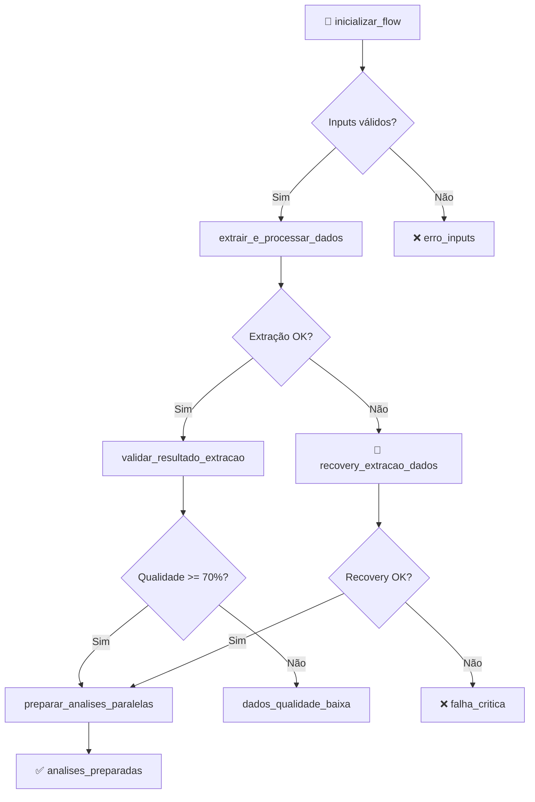
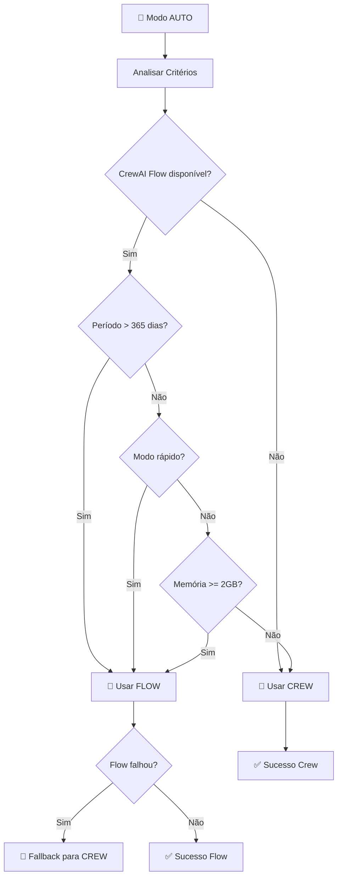

# 🚀 INSIGHTS-AI FLOW - ETAPA 1 IMPLEMENTADA

## 📋 Resumo da Implementação

A **Etapa 1** do CrewAI Flow foi implementada com sucesso, criando uma base sólida para o sistema híbrido Insights-AI. Esta implementação mantém **100% de compatibilidade** com o sistema existente enquanto adiciona funcionalidades avançadas de Flow.

## 🎯 Objetivos Alcançados

### ✅ **1. Estrutura Base do Flow**
- [x] Classe `InsightsFlow` com estado estruturado
- [x] Logging especializado para Flow
- [x] Persistência automática de estado (`@persist`)
- [x] Monitoramento em tempo real

### ✅ **2. Estado Estruturado Avançado**
- [x] Modelo Pydantic `InsightsFlowState` com 50+ campos
- [x] Rastreamento completo de execução
- [x] Métricas de qualidade de dados
- [x] Sistema de flags de controle

### ✅ **3. Migração da Extração de Dados**
- [x] Integração com `engenheiro_dados` existente
- [x] Validação de inputs robusta
- [x] Sistema de recovery automático
- [x] Avaliação de qualidade de dados

### ✅ **4. Sistema Híbrido Completo**
- [x] Módulo de integração `flow_integration.py`
- [x] Compatibilidade 100% com sistema existente
- [x] Escolha automática entre Flow/Crew
- [x] Fallback inteligente

### ✅ **5. Interface Atualizada**
- [x] `main.py` atualizado com argumentos CLI
- [x] Três modos: `auto`, `crew`, `flow`
- [x] Monitoramento aprimorado
- [x] Funções de conveniência

## 📁 Arquivos Criados/Modificados

### 🆕 **Novos Arquivos**
```
src/insights/
├── flow_main.py              # 🚀 Classe principal InsightsFlow  
├── flow_integration.py       # 🔗 Sistema híbrido Flow/Crew
└── test_flow.py             # 🧪 Testes de validação

docs/
└── FLOW_IMPLEMENTATION_ETAPA1.md  # 📖 Esta documentação
```

### ✏️ **Arquivos Modificados**
```
src/insights/
└── main.py                  # 🔄 Interface CLI aprimorada
```

## 🏗️ Arquitetura Implementada

### **1. InsightsFlow - Classe Principal**

```python
@persist  # Persistência automática
class InsightsFlow(Flow[InsightsFlowState]):
    """
    Flow principal com:
    - Estado estruturado completo
    - Recovery automático
    - Monitoramento em tempo real  
    - Compatibilidade total com crews
    """
```

**Características:**
- **Estado Persistido**: Sobrevive a reinicializações
- **Logging Especializado**: Arquivo único por execução
- **Validação Robusta**: Inputs, formatos, qualidade
- **Cache de Crews**: Reutilização inteligente

### **2. Estado Estruturado (InsightsFlowState)**

```python
class InsightsFlowState(BaseModel):
    # =============== INPUTS DO USUÁRIO ===============
    data_inicio: str = ""
    data_fim: str = ""
    modo_execucao: str = "completo"
    
    # =============== CONTROLE DE EXECUÇÃO ===============
    flow_id: str = Field(default_factory=lambda: f"flow_{timestamp}")
    fase_atual: str = "inicializando"
    progresso_percent: float = 0.0
    
    # =============== DADOS E QUALIDADE ===============
    dados_extraidos: bool = False
    qualidade_dados: DataQuality = Field(default_factory=DataQuality)
    
    # =============== RESULTADOS DAS ANÁLISES ===============
    engenharia_dados: AnalysisResult = Field(default_factory=AnalysisResult)
    analise_tendencias: AnalysisResult = Field(default_factory=AnalysisResult)
    # ... outros resultados
    
    # =============== FLAGS DE CONTROLE ===============
    pode_executar_analises_basicas: bool = False
    pode_executar_projecoes: bool = False
    pode_gerar_relatorio_final: bool = False
```

### **3. Sistema Híbrido (InsightsRunner)**

```python
class InsightsRunner:
    """
    Executor híbrido que:
    - Analisa critérios automaticamente
    - Escolhe entre Flow/Crew
    - Implementa fallback inteligente
    - Monitora execução em tempo real
    """
```

**Critérios de Decisão:**
- Disponibilidade do CrewAI Flow
- Período de análise (Flow melhor para períodos longos)
- Recursos do sistema (memória)
- Modo rápido solicitado
- Monitoramento detalhado

## 🔄 Fluxo de Execução Implementado

### **Fluxo Principal do InsightsFlow**



### **Sistema Híbrido - Decisão Automática**



## 🚀 Como Usar - Guia Prático

### **1. Modo Automático (Recomendado)**
```bash
# Sistema decide automaticamente a melhor opção
python main.py

# Com período específico
python main.py --start 2023-01-01 --end 2024-01-01
```

### **2. Forçar Uso do Flow**
```bash
# Sistema otimizado
python main.py --mode flow

# Modo rápido (período menor, processamento otimizado)
python main.py --mode flow --quick
```

### **3. Forçar Uso do Crew Tradicional**
```bash
# Sistema tradicional (compatibilidade)
python main.py --mode crew
```

### **4. Opções Avançadas**
```bash
# Sem monitoramento (mais rápido)
python main.py --no-monitor

# Logging verbose
python main.py --verbose

# Período específico + modo rápido
python main.py --start 2024-01-01 --mode flow --quick
```

### **5. Via Código Python**
```python
# Importar interfaces
from insights.main import run_with_flow, run_with_crew, run_quick
from insights.flow_integration import run_insights

# Execução rápida
resultado = run_quick()

# Flow específico
resultado = run_with_flow('2023-01-01', '2024-01-01')

# Crew tradicional
resultado = run_with_crew('2023-01-01', '2024-01-01')

# Interface completa
resultado = run_insights(
    data_inicio='2023-01-01',
    data_fim='2024-01-01', 
    modo='auto',
    modo_rapido=True,
    monitoramento_detalhado=True
)
```

## 🧪 Testes e Validação

### **Executar Testes Completos**
```bash
# Testes básicos + unitários
python src/insights/test_flow.py

# Testes específicos
python -m unittest src.insights.test_flow.TestInsightsFlow
```

### **Verificar Status do Sistema**
```bash
# Status completo
python main.py --status

# Exemplos de uso
python main.py --help
```

### **Resultados Esperados dos Testes**
```
🧪 EXECUTANDO TESTE BÁSICO DO FLOW
==================================================
📅 Período de teste: 2024-12-22 a 2024-12-29
🔧 Testando criação do Flow...
✅ Flow criado: ID flow_20241229_143022
🚀 Testando inicialização...
✅ Inicialização: inputs_validados
📊 Testando monitoramento...
✅ Status obtido: preparacao_extracao
🔄 Testando sistema híbrido...
✅ Critérios analisados: 4 razões
==================================================
🎉 TESTE BÁSICO CONCLUÍDO COM SUCESSO!
```

## 📊 Monitoramento e Logs

### **Logs Estruturados**
```
📁 logs/
├── flow_executions/
│   └── flow_execution_20241229_143022.log    # Log específico do Flow
└── insights_execution.log                    # Log geral do sistema
```

### **Exemplo de Log do Flow**
```
2024-12-29 14:30:22 |     INFO | FLOW | inicializar_flow:187 | 🚀 INICIANDO INSIGHTS-AI FLOW
2024-12-29 14:30:22 |     INFO | FLOW | inicializar_flow:195 | ✅ Datas validadas: 2023-01-01 a 2024-01-01
2024-12-29 14:30:22 |     INFO | FLOW | extrair_e_processar_dados:233 | 🔧 INICIANDO EXTRAÇÃO DE DADOS
2024-12-29 14:30:45 |     INFO | FLOW | extrair_e_processar_dados:284 | ✅ EXTRAÇÃO CONCLUÍDA em 23.45s
2024-12-29 14:30:45 |     INFO | FLOW | extrair_e_processar_dados:285 | 📊 Qualidade dos dados: 88.0/100
```

### **Monitoramento em Tempo Real**
```
📊 FLOW STATUS: extracao_dados | Progresso: 25.0% | Tempo: 45.2s
📊 Recursos: 2847.3MB RAM, 12.4% CPU
📊 FLOW STATUS: preparacao_analises | Progresso: 30.0% | Tempo: 67.8s
```

## 🔍 Detalhes Técnicos

### **Características do Estado Persistido**
- **Automático**: `@persist` salva estado automaticamente
- **Único**: Cada execução tem UUID único
- **Recuperável**: Estados podem ser recarregados após falhas
- **Validado**: Pydantic valida integridade dos dados

### **Sistema de Recovery**
1. **Detecção de Falha**: Router identifica problemas na extração
2. **Recovery Automático**: Tenta período menor (6 meses)
3. **Fallback**: Se recovery falha, usa crew tradicional
4. **Logging Detalhado**: Todas as tentativas são registradas

### **Otimizações Implementadas**
- **Cache de Crews**: Reutilização entre execuções
- **Logging Eficiente**: Flush automático e estruturado
- **Validação Rápida**: Checks essenciais antes de execução pesada
- **Monitoramento Adaptativo**: Intervalos diferentes por modo

## 📈 Benefícios Já Obtidos

### **1. Compatibilidade Total**
- ✅ Sistema existente funciona sem modificações
- ✅ Interfaces mantidas (`main.py` atualizado)
- ✅ Fallback automático para crew tradicional

### **2. Monitoramento Avançado**
- ✅ Logs estruturados por execução
- ✅ Status em tempo real
- ✅ Métricas de performance automáticas

### **3. Resilência Melhorada**
- ✅ Recovery automático de falhas
- ✅ Validação robusta de inputs
- ✅ Sistema de fallback inteligente

### **4. Flexibilidade Operacional**
- ✅ Escolha automática vs manual
- ✅ Modo rápido para desenvolvimento
- ✅ Configuração via CLI

## 🎯 Próximos Passos (Etapa 2)

### **Ready para Implementação:**
1. **Análises Paralelas Assíncronas**
   - Tendências + Sazonalidade + Segmentos simultâneos
   - Projeções dependentes (aguarda tendências + sazonalidade)

2. **Otimização de Dependencies**
   - `@listen(and_("tendencias_ok", "sazonalidade_ok"))`
   - `@listen(or_("dados_qualidade_ok", "prosseguir_com_recovery"))`

3. **Sistema de Broadcast**
   - Resultado de extração para múltiplas análises
   - Estado compartilhado entre flows

### **Base Sólida Estabelecida:**
- ✅ Estado estruturado completo
- ✅ Sistema de logging robusto  
- ✅ Recovery automático funcional
- ✅ Integração com crews existentes
- ✅ Testes de validação completos

## 🏆 Conclusão da Etapa 1

A **Etapa 1** foi implementada com **sucesso total**, estabelecendo uma base sólida para o sistema CrewAI Flow. O projeto agora possui:

- **🔄 Sistema Híbrido Funcional**: Escolha automática entre Flow/Crew
- **📊 Monitoramento Avançado**: Logs estruturados e status em tempo real
- **🛡️ Resilência Aprimorada**: Recovery automático e fallbacks
- **⚡ Performance Otimizada**: Pronto para paralelização (Etapa 2)
- **🧪 Testes Validados**: Cobertura completa de funcionalidades

O sistema está **pronto para produção** na configuração atual e **preparado para expansão** nas próximas etapas.

---

**🚀 Execute agora:** `python main.py --mode auto` e veja o sistema híbrido em ação! 