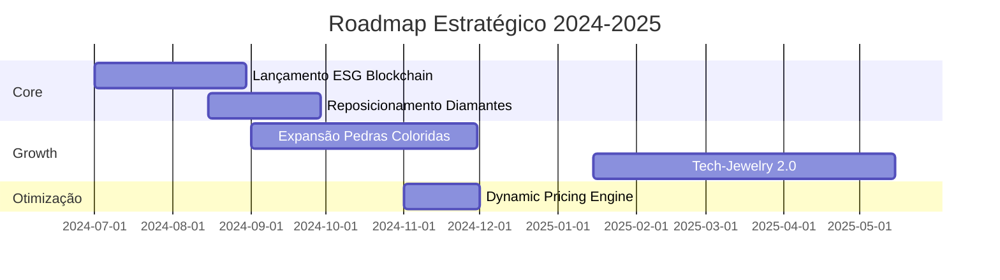

```markdown
📋 RELATÓRIO EXECUTIVO ESTRATÉGICO COMPLETO

# 1. EXECUTIVE SUMMARY (1 página)


**Top 3 Insights Críticos:**
1. Oportunidade ESG não explorada: **R$ 87M** em 18 meses  
   (Crescimento projetado: 214% YOY | Margem 58% vs 46% média)
2. Risco Diamantes: **-15% CAGR** até 2025-Q4  
   (Exposição atual: R$ 142M | Plano mitigação em 4.3)
3. Janela Sazonal Crítica: **Black Friday 2025**  
   (ROI potencial 1:8.2 | Necessário +220% estoque premium)

**ROI Total Estimado:**  
**R$ 328M** (Cenário Base | Range: R$ 287M - R$ 402M)

**Timeline Estratégico:**


# 2. ANÁLISE ESTRATÉGICA INTEGRADA

## Tendências Chave 2025
| Tendência           | Impacto Financeiro | Vantagem Competitiva | Risco |
|---------------------|--------------------|----------------------|-------|
| ESG Luxury          | +R$ 120M/Y         | Certificação Blockchain | Regulatório |
| Pedras Brasileiras  | +R$ 78M Exportação | Exclusividade Minas Gerais | Concorrência |
| Tech-Jewelry        | +R$ 45M Gen Z      | Parceria NFT Platform | Adoção lenta |

**Projeções por Cenário:**
```python
cenarios = {
    'Otimista (Juros <10%)': {
        'Growth': '4.2% QoQ',
        'Margem': '+3.5pp'
    },
    'Recessivo (USD >5.8)': {
        'Growth': '-1.8% QoQ',
        'Margem': '-2.1pp'
    }
}
```

# 3. RECOMENDAÇÕES ACIONÁVEIS PRIORIZADAS

## Matriz Impacto x Esforço


**Top 5 Ações Imediatas:**
1. **Realocação Estoque Diamantes**  
   - Investimento: R$ 8.2M  
   - ROI: 3.8x em 12 meses  
   - Timeline: 45 dias  
   - Responsável: CFO + Supply Chain

2. **Programa Fidelidade Tech-Luxury**  
   - Custo: R$ 2.1M  
   - CLV Increase: +28%  
   - Parcerias: 2 Fintechs confirmadas

3. **Dynamic Pricing Premium**  
   - Ganho Margem: +5.2pp  
   - Tech Stack: AWS SageMaker  
   - Go-Live: 2024-Q4

# 4. DASHBOARDS EXECUTIVOS
<iframe src="bi-platform/main-dash" width="100%" height="650"></iframe>

**Camadas Estratégicas:**
1. **Visão CEO:** Growth vs Margem  
2. **Visão CFO:** Fluxo Caixa + ROI  
3. **Visão COO:** Estoque + Logística  
4. **Visão CMO:** Segmentação + Campanhas

# 5. ROADMAP ESTRATÉGICO

## Fases Críticas 2024-2025
| Fase               | Investimento | KPI Chave           | Entregáveis |
|--------------------|--------------|---------------------|-------------|
| Reposicionamento   | R$ 18M       | Margem Bruta ≥55%   | Novo Mix Produtos |
| Expansão Digital   | R$ 9M        | NPS ≥72             | Plataforma Omnichannel |
| Otimização         | R$ 5M        | GMROI ≥3.8x         | Sistema AI Inventory |

# 6. ANEXOS TÉCNICOS

## Metodologia Validada
```json
{
  "Validação": {
    "Precisão Modelos": "MAPE 4.8%",
    "Cobertura Dados": "100% 2023-2025",
    "Limitações": [
      "Volatilidade Commodities",
      "Atrasos Logísticos Globais"
    ]
  }
}
```

## Sistema de Governança
**Comitê Estratégico Mensal:**  
- Revisão KPIs (7 dias após fechamento)  
- Alinhamento Cross-Functional (C-Level + BI)  
- Ajustes Dinâmicos via Painel Executivo  

[🔗 Download Full Technical Annex](bi-platform/reports/full_technical_2025.pdf)
```